# Big Event Project

> a website for Nvidia GTC 2022 event 22 March - 24 March

### Home page:
- desktop view:
	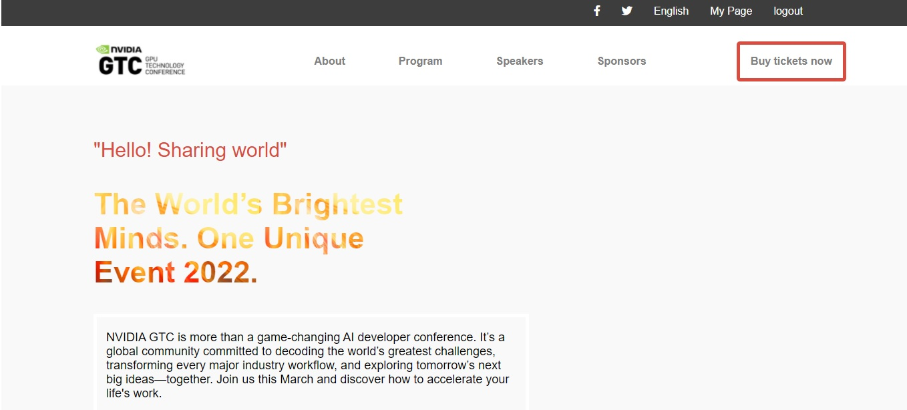
	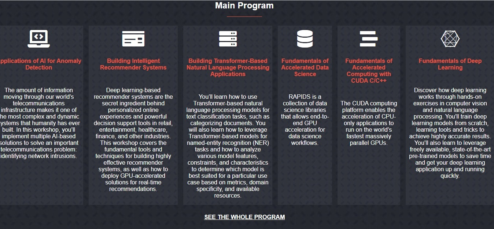
	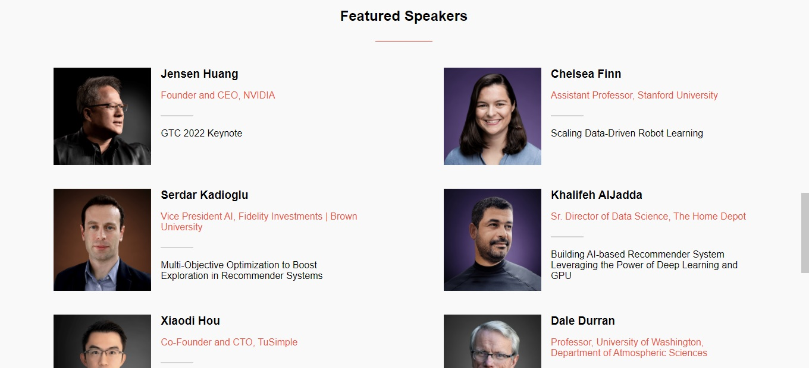
	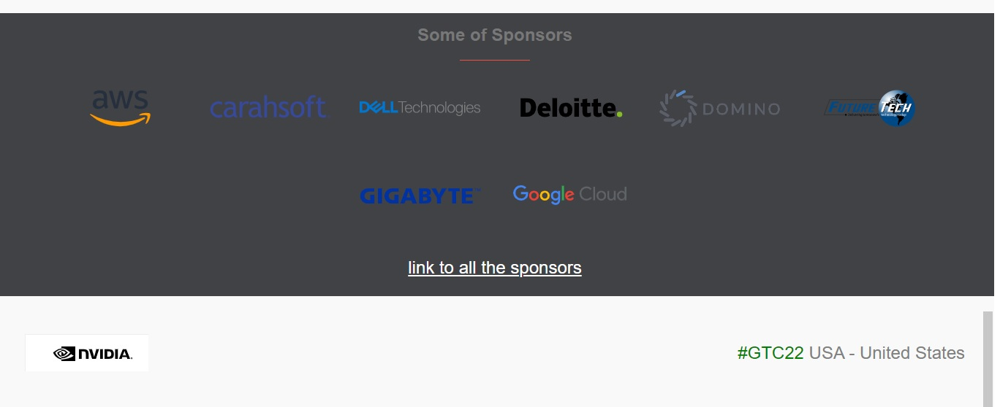
- mobile view:
	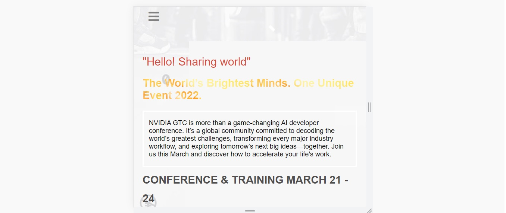
	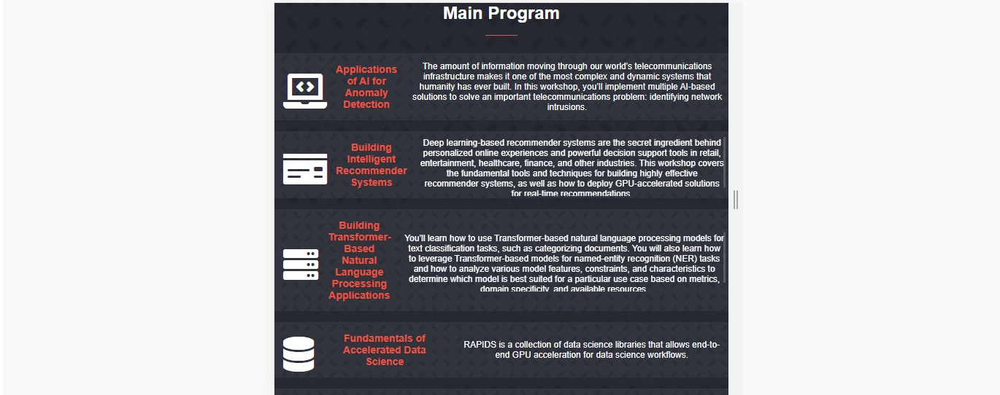
	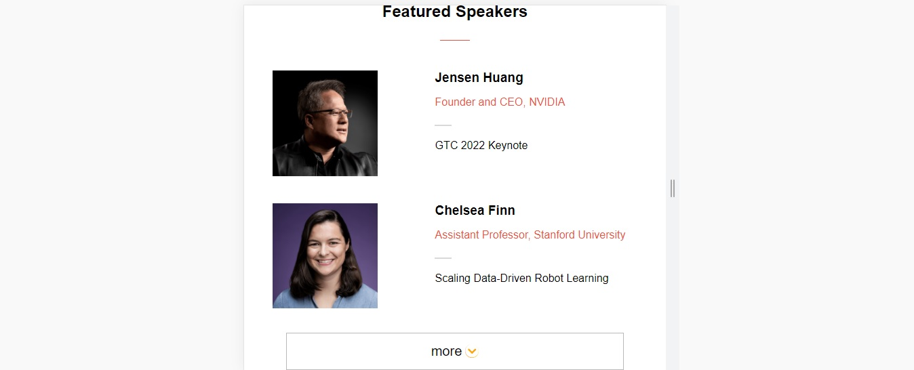

### About page :
- desktop view:
	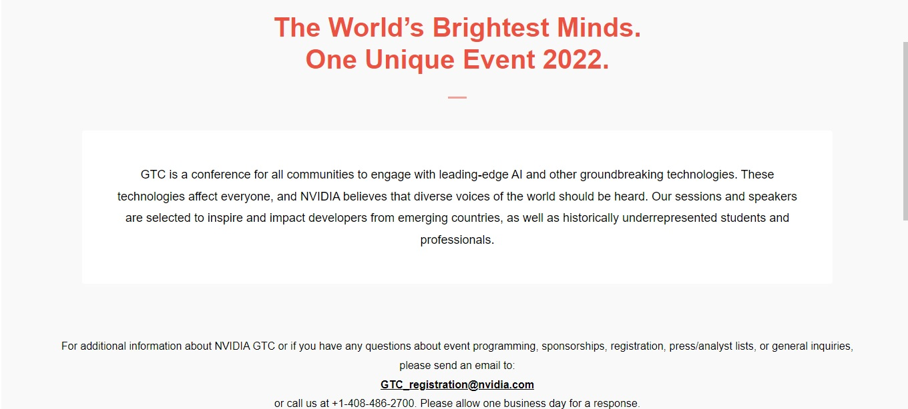
	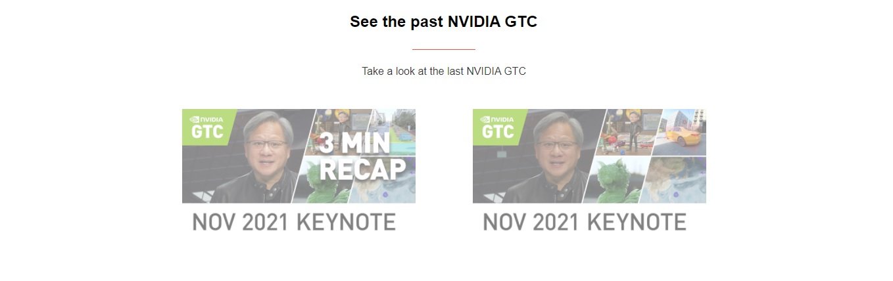
	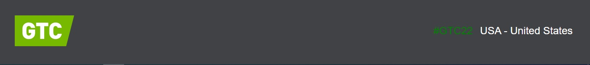
- mobile view:
	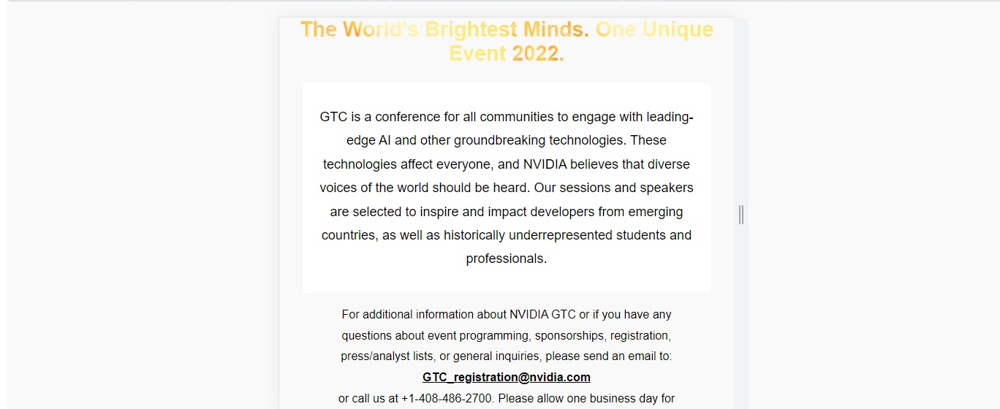
	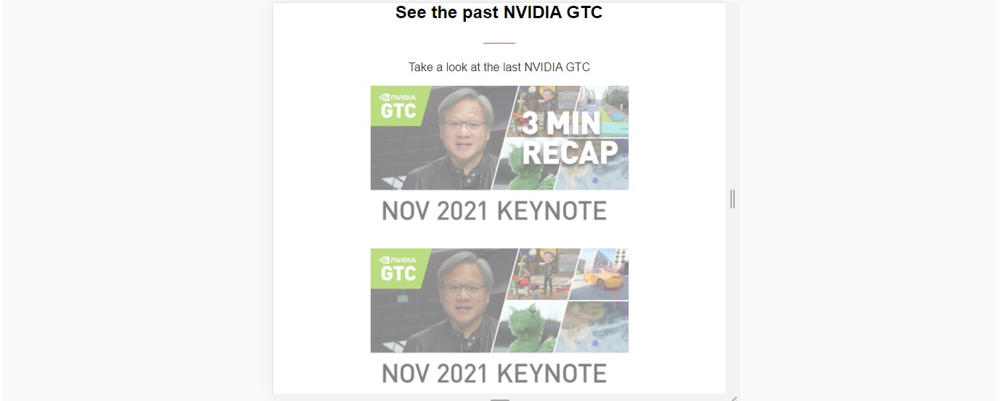
	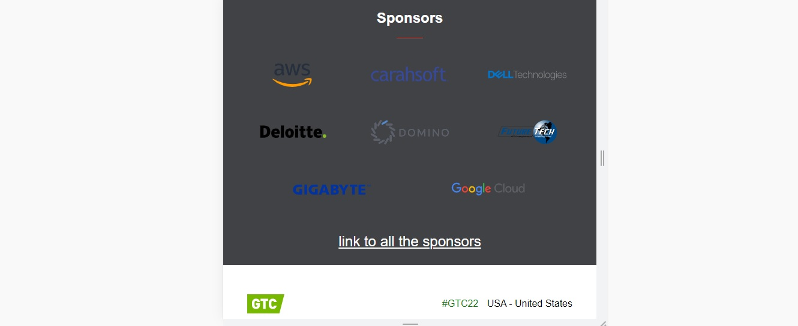

- Mobile menu:
	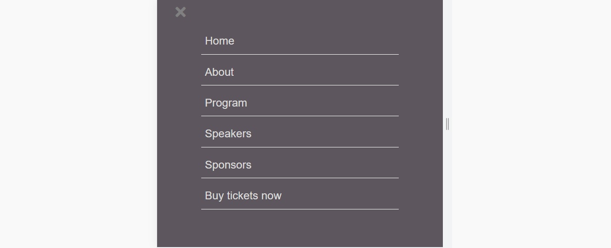

1st capstone project at mcroverse "big event project" :

building website that display information about Nvidia GTC March 2022

## Built With

- HTML
- SCSS
- liners for testing

## Live Demo

[view portfolio](https://saied2035.github.io/capstone-project1)

## Getting Started

To get a local copy up and running follow these simple example steps.

### Install
 
 after cloning the repo run 
 `npm install`

### Usage
   run 
   `python -m http.sever`
### Run tests
   `npx hint .` for html check. giving hints about what is needed to and to your html page
   `npx stylelint "**/*.{css,scss}"` for css check
   `npx stylelint "**/*.{css,scss}" --fix` to fix css isues if found
   `npx eslint .` for JS check
   `npx eslint . --fix` to fix JS isues if found   

## Authors

👤 **Saied Gaffer**

- GitHub: [@Saied2035](https://github.com/saied2035)
- Twitter: [@SaiedGaffer](https://twitter.com/SaiedGaffer)
- LinkedIn: [LinkedIn](https://www.linkedin.com/in/saiedgaffer/)

## 🤝 Contributing

Contributions, issues, and feature requests are welcome!

Feel free to check the [issues page](https://github.com/saied2035/capstone-project1/issues).

## Show your support

Give a ⭐️ if you like this project!

## Acknowledgments

- Microverse: [microverse community](https://github.com/microverseinc)
- Clinton Mbonu: [Clinton Mbonu](https://github.com/clintonjosephs) 
   I used his repo which called Portfolio_website to get font sizes and colors.

## Design Credit
- Original design by [Cindy Shin](https://www.behance.net/adagio07)
